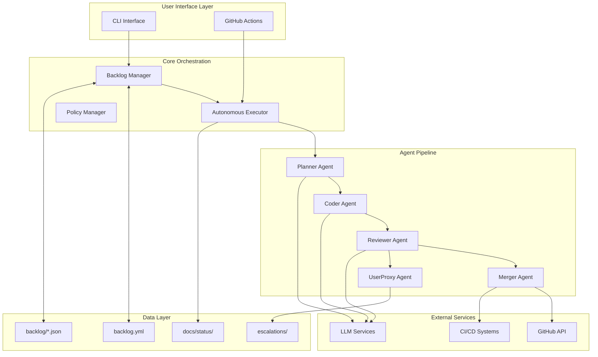

# Agentic Development Orchestrator - Architecture

## Overview

The Agentic Development Orchestrator (ADO) is a Python-based CLI tool and framework that implements autonomous software development lifecycle management using AI agents. The system utilizes the Weighted Shortest Job First (WSJF) methodology for task prioritization and coordinates multiple AI agents through a structured pipeline.

## System Architecture

### High-Level Components



### Component Details

#### 1. Backlog Manager (`backlog_manager.py`)

**Responsibilities:**
- Load and parse backlog configuration from YAML and JSON files
- Calculate WSJF scores using SAFe methodology
- Maintain backlog item lifecycle states
- Provide prioritized task queues
- Generate status reports and metrics

**Key Classes:**
- `BacklogItem`: Data model for individual backlog items
- `BacklogManager`: Core orchestration for backlog operations

**WSJF Calculation:**
```
WSJF = (User-Business Value + Time Criticality + Risk Reduction & Opportunity Enablement) / Job Size
```

#### 2. Autonomous Executor (`autonomous_executor.py`)

**Responsibilities:**
- Implement macro execution loop for continuous processing
- Coordinate micro-cycles for individual task execution
- Manage agent pipeline transitions
- Handle escalation scenarios
- Maintain execution state and recovery

**Execution Flow:**
1. **Macro Loop**: Continuous backlog processing
2. **Micro Cycle**: Individual task execution through agent pipeline
3. **Safety Gates**: Policy enforcement and human-in-the-loop triggers
4. **Recovery**: Error handling and rollback mechanisms

#### 3. Agent Pipeline

**Planner Agent:**
- Analyzes backlog items and creates detailed implementation plans
- Breaks down complex tasks into manageable steps
- Identifies dependencies and prerequisites
- Generates technical specifications

**Coder Agent:**
- Implements code changes based on planner specifications
- Follows coding standards and best practices
- Creates unit tests and documentation
- Generates commit messages

**Reviewer Agent:**
- Performs code quality analysis
- Runs automated tests and security scans
- Validates against acceptance criteria
- Determines approval or escalation

**Merger Agent:**
- Creates GitHub pull requests
- Manages branch operations
- Coordinates with CI/CD systems
- Handles deployment triggers

**UserProxy Agent:**
- Implements human-in-the-loop pattern
- Handles escalation scenarios
- Manages policy exceptions
- Provides manual override capabilities

### Data Models

#### Backlog Item Schema

```yaml
id: string              # Unique identifier
title: string           # Human-readable title
type: string            # feature|bug|chore|epic
description: string     # Detailed description
acceptance_criteria:    # List of acceptance criteria
  - string
effort: integer         # Fibonacci scale (1,2,3,5,8,13)
value: integer          # Business value (1-10)
time_criticality: integer # Time sensitivity (1-10)
risk_reduction: integer # Risk/opportunity value (1-10)
status: string          # NEW|REFINED|READY|DOING|PR|DONE|BLOCKED
risk_tier: string       # low|medium|high
created_at: string      # ISO timestamp
links:                  # Related resources
  - string
```

#### Execution Result Schema

```python
@dataclass
class ExecutionResult:
    success: bool
    item_id: str
    error_message: Optional[str]
    artifacts: List[str]
    test_results: Optional[Dict]
    security_status: str
```

### Security Architecture

#### Policy Enforcement
- **Pre-execution**: Validate task safety and permissions
- **Runtime**: Monitor resource usage and API limits
- **Post-execution**: Security scanning and compliance checks

#### Escalation Framework
- **Automatic Triggers**: Test failures, security violations, policy breaches
- **Manual Triggers**: Complex decisions, ambiguous requirements
- **Resolution**: Human review and intervention through UserProxy

### Integration Patterns

#### GitHub Integration
- **Authentication**: Personal Access Token (PAT) based
- **Operations**: Branch management, PR creation, status updates
- **Webhooks**: CI/CD status monitoring

#### LLM Integration
- **Authentication**: API key based (OpenAI, Azure, etc.)
- **Usage Patterns**: Structured prompts with context injection
- **Rate Limiting**: Intelligent backoff and queue management

#### CI/CD Integration
- **Triggers**: Automated testing on PR creation
- **Status Monitoring**: Build and test result integration
- **Deployment**: Conditional deployment based on criteria

### Performance Considerations

#### Scalability
- **Parallel Processing**: Multiple agents can work on different tasks
- **Queue Management**: Priority-based task scheduling
- **Resource Limits**: Configurable execution limits and timeouts

#### Reliability
- **Error Recovery**: Automatic retry with exponential backoff
- **State Persistence**: Execution state saved to filesystem
- **Graceful Degradation**: Fallback modes for service failures

### Configuration Management

#### Environment Variables
- `GITHUB_TOKEN`: GitHub API authentication
- `OPENAI_API_KEY`: LLM service authentication
- `ADO_CONFIG_PATH`: Custom configuration location
- `ADO_LOG_LEVEL`: Logging verbosity control

#### File Structure
```
project/
├── backlog.yml           # Main backlog configuration
├── backlog/              # Individual backlog items
│   ├── item-001.json
│   └── item-002.json
├── docs/
│   ├── status/           # Execution reports
│   └── adr/              # Architecture decisions
├── escalations/          # Human intervention logs
└── .ado/                 # Runtime configuration
```

### Monitoring and Observability

#### Metrics Collection
- **Execution Metrics**: Success rates, execution times, error frequencies
- **Backlog Metrics**: Item aging, throughput, cycle times
- **Agent Metrics**: Performance per agent type, resource utilization

#### Logging Strategy
- **Structured Logging**: JSON format with consistent fields
- **Log Levels**: DEBUG, INFO, WARN, ERROR for different audiences
- **Correlation IDs**: Track execution across components

#### Health Checks
- **System Health**: Database connectivity, API availability
- **Agent Health**: LLM service status, rate limit status
- **Integration Health**: GitHub API, CI/CD system status

### Future Architecture Considerations

#### Multi-Repository Support (v0.2.0)
- **Repository Discovery**: Scan for `ado.yml` configuration files
- **Cross-Repository Dependencies**: Manage dependencies between repositories
- **Unified Backlog**: Aggregate view across multiple repositories

#### SaaS Platform (v1.0.0)
- **Web Dashboard**: Browser-based management interface
- **Multi-Tenancy**: Organization and team isolation
- **Enterprise Integration**: SSO, RBAC, audit logging

#### Advanced Agent Capabilities
- **Learning Agents**: Improve performance based on historical data
- **Specialized Agents**: Domain-specific agents for different technologies
- **Agent Orchestration**: Dynamic agent selection based on task characteristics

## Decision Records

Architecture decisions are documented in the `/docs/adr/` directory following the ADR format. Key decisions include:

- ADR-001: Choice of WSJF for prioritization methodology
- ADR-002: Agent pipeline architecture over monolithic approach
- ADR-003: File-based persistence over database storage
- ADR-004: UserProxy pattern for human-in-the-loop implementation

## Security Considerations

### Threat Model
- **Code Injection**: Malicious backlog items attempting code execution
- **Credential Exposure**: API keys and tokens in logs or artifacts
- **Privilege Escalation**: Unauthorized repository or system access
- **Data Exfiltration**: Sensitive information in agent communications

### Mitigation Strategies
- **Input Validation**: Strict schema validation for all inputs
- **Sandboxing**: Isolated execution environments for code generation
- **Credential Management**: Secure storage and rotation of secrets
- **Audit Logging**: Comprehensive logging of all operations

---

*This architecture document is maintained as a living document and updated with significant system changes. Last updated: January 2025*