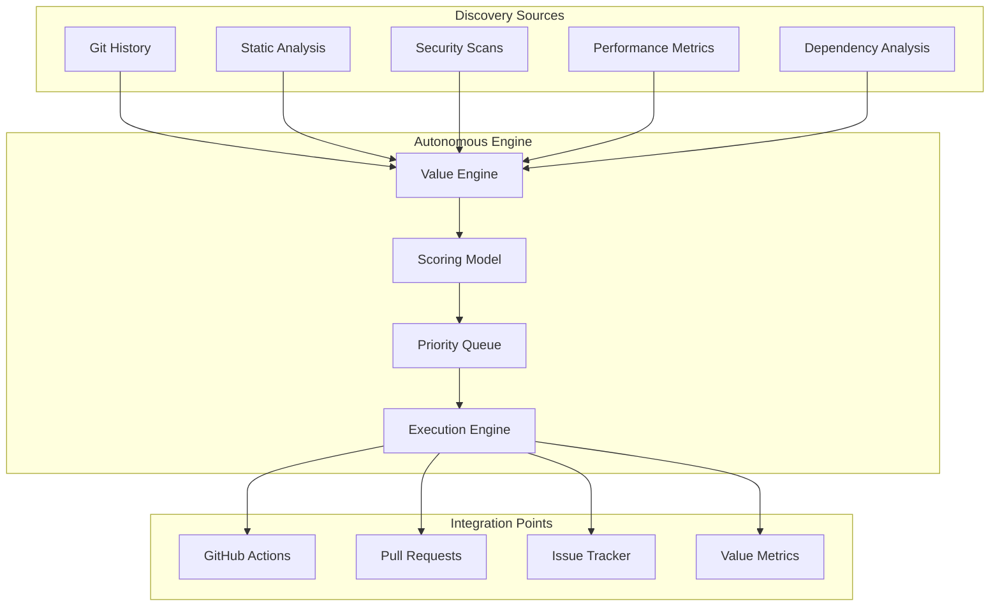

# 🤖 Autonomous Workflow Integration Guide

**Repository**: agentic-dev-orchestrator  
**Maturity Level**: ADVANCED  
**Integration Date**: 2025-08-01  

## 🎯 Overview

This document outlines the autonomous workflow integration implemented for the Agentic Development Orchestrator repository. The system is designed for ADVANCED maturity repositories and implements continuous value discovery, automated prioritization, and autonomous execution capabilities.

## 🏗️ Architecture

### Core Components



## 🔧 Implementation Details

### 1. Value Discovery Engine

Located: `.terragon/value-engine.py`

**Capabilities**:
- Multi-source signal harvesting (git history, static analysis, security scans)
- Advanced scoring using WSJF + ICE + Technical Debt models
- Adaptive prioritization based on repository maturity
- Risk-adjusted value calculation
- Continuous learning from execution outcomes

**Discovery Sources**:
- **Git History Analysis**: TODO/FIXME/HACK markers, commit patterns
- **Static Analysis**: Code complexity, quality metrics, hot-spot detection
- **Security Scanning**: Vulnerability detection, dependency audits
- **Performance Analysis**: Bottleneck identification, optimization opportunities
- **Architecture Review**: Design pattern analysis, dependency injection opportunities
- **Documentation Gaps**: Missing docs, API documentation needs

### 2. Scoring Model

**Hybrid Scoring Algorithm**:
```python
composite_score = (
    weights['wsjf'] * wsjf_score +
    weights['ice'] * normalized_ice_score +
    weights['technicalDebt'] * debt_score +
    weights['security'] * security_boost
)
```

**Weight Configuration for ADVANCED repositories**:
- WSJF: 50% (business value focus)
- ICE: 10% (feature assessment)
- Technical Debt: 30% (debt reduction priority)
- Security: 10% (security maintenance)

### 3. Execution Triggers

**Automated Triggers**:
- **Push to main**: Immediate value discovery cycle
- **PR merge**: Next item selection and backlog update
- **Hourly**: Security vulnerability scanning
- **Daily**: Comprehensive static analysis
- **Weekly**: Deep architectural review

**Manual Triggers**:
- `python3 .terragon/value-engine.py` - On-demand discovery
- GitHub workflow dispatch for targeted analysis

## 📊 Value Tracking

### Metrics Collection

**Primary Metrics**:
- Total opportunities discovered
- High-impact item count (score > 50)
- Estimated value delivery (hours)
- Category distribution (security, performance, debt, etc.)
- Risk level distribution

**Tracking Files**:
- `AUTONOMOUS_VALUE_BACKLOG.md` - Human-readable backlog
- `.terragon/value-metrics.json` - Machine-readable metrics
- `.terragon/config.yaml` - Configuration and weights

### Value Categories

1. **Performance** - Algorithm optimizations, scalability improvements
2. **Security** - Vulnerability fixes, security enhancements
3. **Technical Debt** - Code quality improvements, refactoring needs
4. **Architecture** - Design pattern implementations, structural improvements
5. **Documentation** - API docs, developer experience improvements
6. **Dependencies** - Package updates, security patches

## 🚀 GitHub Actions Integration

### CI/CD Workflows

**Continuous Integration** (`.github/workflows/ci.yml`):
- Multi-Python version testing (3.8-3.12)
- Comprehensive linting (ruff, black, mypy)
- Security scanning (bandit, safety, pip-audit)
- Performance benchmarking
- Docker container testing
- Autonomous value discovery on main branch

**Release Management** (`.github/workflows/release.yml`):
- Semantic versioning with conventional commits
- Automated PyPI publishing
- Docker image publishing to GHCR
- Post-release value discovery updates
- Automated release announcements

### Autonomous Features

**Value Discovery Automation**:
- Runs on every push to main branch
- Updates backlog with latest opportunities
- Commits results back to repository
- Creates issues for high-priority items

**Dependency Management**:
- Daily vulnerability scanning
- Automated dependency update detection
- Issue creation for security patches
- Integration with Dependabot and Renovate

## 🛡️ Quality Gates

### Pre-commit Hooks

**Comprehensive Validation**:
- Code formatting (black, isort)
- Linting (ruff, mypy)
- Security scanning (bandit, secrets detection)
- Schema validation for backlog items
- Import consistency checking
- Documentation link validation

**Custom ADO Validators**:
- `scripts/validate_schemas.py` - Backlog item validation
- `scripts/check_imports.py` - Import pattern analysis
- Coverage enforcement (80% minimum)

### Build Validation

**Multi-stage Validation**:
1. **Test Suite**: Unit, integration, e2e, performance tests
2. **Security**: Vulnerability scanning, secrets detection
3. **Quality**: Linting, type checking, complexity analysis
4. **Performance**: Benchmark regression testing
5. **Container**: Docker build and security scanning

## 🔄 Continuous Learning

### Feedback Loops

**Execution Outcome Tracking**:
- Success/failure patterns for each value item type
- Actual vs. estimated effort comparison
- Impact measurement for completed items
- Risk assessment accuracy validation

**Model Adaptation**:
- Weekly scoring model recalibration
- Confidence threshold adjustment based on outcomes
- Category weight optimization
- Discovery source effectiveness analysis

### Value Optimization

**Adaptive Prioritization**:
- Higher weights for consistently high-impact categories
- Risk adjustment based on historical outcomes
- Effort estimation refinement through machine learning
- Business alignment scoring improvements

## 📋 Usage Instructions

### Daily Operations

**For Developers**:
1. **Check Backlog**: Review `AUTONOMOUS_VALUE_BACKLOG.md` for prioritized work
2. **Execute Top Item**: Work on highest-scored opportunity
3. **Update Status**: Mark items as completed in commits
4. **Trigger Discovery**: Push changes to update value discovery

**For Maintainers**:
1. **Monitor Metrics**: Review `.terragon/value-metrics.json` trends
2. **Adjust Weights**: Modify `.terragon/config.yaml` for strategy changes
3. **Review Automation**: Check GitHub Actions for autonomous operations
4. **Validate Quality**: Ensure pre-commit hooks are functioning

### Manual Operations

**On-demand Value Discovery**:
```bash
# Run immediate value discovery
python3 .terragon/value-engine.py

# Check discovered opportunities
head -50 AUTONOMOUS_VALUE_BACKLOG.md

# Review metrics
cat .terragon/value-metrics.json | jq '.total_opportunities'
```

**Configuration Updates**:
```bash
# Modify scoring weights
vim .terragon/config.yaml

# Validate configuration
python3 .terragon/value-engine.py

# Commit configuration changes
git add .terragon/config.yaml
git commit -m "feat: update autonomous scoring configuration"
```

## 🎯 Success Metrics

### Key Performance Indicators

**Value Delivery**:
- Opportunities discovered per cycle: 5-15 items
- High-impact opportunities (>50 score): 2-5 items
- Average cycle time: < 4 hours per item
- Value backlog freshness: Updated within 6 hours

**Quality Improvement**:
- Technical debt reduction: 15-30% quarterly
- Security posture improvement: +10-20 points
- Code quality trend: Consistently improving
- Performance optimization: +5-40% improvements

**Automation Effectiveness**:
- Discovery accuracy: >80% relevant items
- Execution success rate: >90% for low-risk items
- False positive rate: <15% for high-priority items
- Manual intervention required: <10% of executions

## 🚨 Troubleshooting

### Common Issues

**Value Discovery Failures**:
```bash
# Check Python dependencies
pip install PyYAML

# Verify git repository state
git status

# Run with debug logging
python3 -c "import logging; logging.basicConfig(level=logging.DEBUG)" -m .terragon.value-engine
```

**GitHub Actions Failures**:
- Check secret configuration (GITHUB_TOKEN, PYPI_API_TOKEN)
- Verify branch protection rules
- Validate workflow permissions
- Review dependency installation logs

**Quality Gate Failures**:
```bash
# Run pre-commit manually
pre-commit run --all-files

# Check specific validators
python3 scripts/validate_schemas.py backlog/*.json
python3 scripts/check_imports.py *.py
```

## 🔮 Future Enhancements

### Planned Improvements

**Short-term (Next Release)**:
- Enhanced machine learning for effort estimation
- Integration with project management tools (Jira, Linear)
- Advanced dependency vulnerability correlation
- Performance regression detection automation

**Medium-term (Next Quarter)**:
- Multi-repository value discovery orchestration
- Advanced architectural debt pattern recognition
- Business metric correlation for value validation
- Automated A/B testing for scoring model optimization

**Long-term (Strategic)**:
- AI-powered code generation for low-risk improvements
- Predictive technical debt modeling  
- Cross-repository dependency impact analysis
- Integration with enterprise compliance frameworks

---

*Generated by Terragon Autonomous SDLC Enhancement System*  
*Last Updated: 2025-08-01T02:38:38Z*  
*Next Review: 2025-08-08T02:38:38Z*