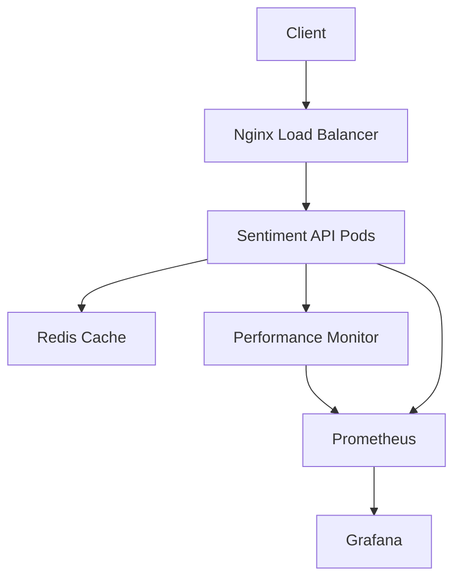

# 🚀 Sentiment Analysis Deployment Guide

This guide covers deploying the sentiment analysis system to production environments using Docker, Kubernetes, and cloud platforms.

## 📋 Prerequisites

- Docker 20.10+
- Docker Compose 2.0+
- Python 3.8+
- 4GB+ RAM for production deployment
- SSL certificates (for HTTPS)

## 🏗️ Architecture Overview



## 🐳 Docker Deployment

### Quick Start

```bash
# Clone and deploy
git clone <repository-url>
cd agentic-dev-orchestrator

# Deploy with default configuration
./scripts/deploy-sentiment.sh deploy
```

### Custom Configuration

1. **Create environment file:**
```bash
cp .env.example .env
# Edit .env with your configuration
```

2. **Deploy with custom settings:**
```bash
VERSION=v1.0.0 ENVIRONMENT=production ./scripts/deploy-sentiment.sh deploy
```

### Service URLs

- **API Endpoint**: `http://localhost:5000` or `https://localhost`
- **Prometheus**: `http://localhost:9090`
- **Grafana**: `http://localhost:3000` (admin/admin123)
- **Redis**: `localhost:6379`

## ☸️ Kubernetes Deployment

### Setup

1. **Apply configurations:**
```bash
kubectl apply -f k8s/sentiment-deployment.yaml
```

2. **Configure secrets:**
```bash
# Create secrets
kubectl create secret generic sentiment-secrets \
  --from-literal=OPENAI_API_KEY=your-key-here \
  -n sentiment-analysis
```

3. **Update ingress:**
```yaml
# Edit k8s/sentiment-deployment.yaml
spec:
  rules:
  - host: sentiment.yourdomain.com  # Replace with your domain
```

### Monitoring

```bash
# Check deployment status
kubectl get pods -n sentiment-analysis

# View logs
kubectl logs -f deployment/sentiment-api -n sentiment-analysis

# Scale deployment
kubectl scale deployment sentiment-api --replicas=5 -n sentiment-analysis
```

## ☁️ Cloud Platform Deployment

### AWS ECS

```bash
# Build and push to ECR
aws ecr get-login-password --region us-west-2 | docker login --username AWS --password-stdin 123456789012.dkr.ecr.us-west-2.amazonaws.com
docker build -f docker/sentiment.Dockerfile -t sentiment-api .
docker tag sentiment-api:latest 123456789012.dkr.ecr.us-west-2.amazonaws.com/sentiment-api:latest
docker push 123456789012.dkr.ecr.us-west-2.amazonaws.com/sentiment-api:latest

# Deploy to ECS using AWS CLI or CloudFormation
```

### Google Cloud Run

```bash
# Build and deploy
gcloud builds submit --tag gcr.io/PROJECT_ID/sentiment-api
gcloud run deploy sentiment-api \
  --image gcr.io/PROJECT_ID/sentiment-api \
  --platform managed \
  --region us-central1 \
  --allow-unauthenticated
```

### Azure Container Instances

```bash
# Deploy to Azure
az container create \
  --resource-group myResourceGroup \
  --name sentiment-api \
  --image youracr.azurecr.io/sentiment-api:latest \
  --ports 5000 \
  --environment-variables LOG_LEVEL=INFO
```

## 🔧 Configuration

### Environment Variables

| Variable | Description | Default | Required |
|----------|-------------|---------|----------|
| `LOG_LEVEL` | Logging level | `INFO` | No |
| `SENTIMENT_MAX_WORKERS` | Max worker threads | `4` | No |
| `SENTIMENT_BATCH_SIZE` | Batch processing size | `20` | No |
| `SENTIMENT_CACHE_TTL` | Cache TTL in seconds | `3600` | No |
| `REDIS_URL` | Redis connection URL | `redis://redis:6379/0` | No |
| `OPENAI_API_KEY` | OpenAI API key | - | For enhanced features |
| `CORS_ORIGINS` | Allowed CORS origins | `*` | No |

### Performance Tuning

```yaml
# docker-compose.sentiment.yml
services:
  sentiment-api:
    deploy:
      resources:
        limits:
          memory: 2G        # Adjust based on load
          cpus: '2.0'       # Adjust based on CPU cores
        reservations:
          memory: 1G
          cpus: '1.0'
    environment:
      - SENTIMENT_MAX_WORKERS=8    # 2x CPU cores
      - SENTIMENT_BATCH_SIZE=50    # Larger batches for throughput
```

## 📊 Monitoring & Observability

### Health Checks

```bash
# API health check
curl -f http://localhost:5000/health

# Detailed status
curl http://localhost:5000/metrics
```

### Prometheus Metrics

- `sentiment_requests_total` - Total API requests
- `sentiment_request_duration_seconds` - Request duration histogram
- `sentiment_cache_hit_rate` - Cache hit rate percentage
- `sentiment_batch_size` - Average batch size
- `sentiment_errors_total` - Total error count

### Grafana Dashboards

1. Import dashboard from `monitoring/grafana-sentiment.json`
2. Configure Prometheus data source: `http://prometheus:9090`
3. View real-time metrics and alerts

## 🔒 Security

### SSL/TLS Configuration

1. **Production certificates:**
```bash
# Let's Encrypt
certbot certonly --webroot -w /var/www/html -d sentiment.yourdomain.com

# Copy certificates
cp /etc/letsencrypt/live/sentiment.yourdomain.com/fullchain.pem nginx/ssl/cert.pem
cp /etc/letsencrypt/live/sentiment.yourdomain.com/privkey.pem nginx/ssl/key.pem
```

2. **Update nginx configuration:**
```nginx
ssl_certificate /etc/nginx/ssl/cert.pem;
ssl_certificate_key /etc/nginx/ssl/key.pem;
```

### API Security

- **Rate limiting**: 100 requests/minute per IP
- **CORS**: Configurable origins
- **Input validation**: Automatic sanitization
- **Security headers**: HSTS, XSS protection, etc.

## 🔍 Troubleshooting

### Common Issues

1. **Service won't start:**
```bash
# Check logs
docker-compose -f docker-compose.sentiment.yml logs sentiment-api

# Check health
curl -v http://localhost:5000/health
```

2. **High memory usage:**
```bash
# Reduce batch size
export SENTIMENT_BATCH_SIZE=10

# Limit workers
export SENTIMENT_MAX_WORKERS=2
```

3. **Cache issues:**
```bash
# Clear Redis cache
docker-compose exec redis redis-cli FLUSHALL

# Restart with fresh cache
docker-compose restart sentiment-api
```

### Performance Issues

1. **Slow response times:**
   - Increase `SENTIMENT_MAX_WORKERS`
   - Enable Redis caching
   - Use batch processing for multiple texts

2. **High CPU usage:**
   - Reduce concurrent workers
   - Implement request queuing
   - Scale horizontally

### Debug Mode

```bash
# Enable debug logging
export LOG_LEVEL=DEBUG

# Run with profiling
export PYTHONPROFILE=1

# Restart services
docker-compose restart sentiment-api
```

## 🔄 Maintenance

### Updates

```bash
# Update to new version
VERSION=v1.1.0 ./scripts/deploy-sentiment.sh deploy

# Rolling update (Kubernetes)
kubectl set image deployment/sentiment-api sentiment-api=sentiment:v1.1.0 -n sentiment-analysis
```

### Backup

```bash
# Backup Redis data
docker-compose exec redis redis-cli BGSAVE

# Backup configuration
tar -czf sentiment-backup-$(date +%Y%m%d).tar.gz \
  docker-compose.sentiment.yml nginx/ k8s/ .env
```

### Scaling

```bash
# Scale Docker services
docker-compose -f docker-compose.sentiment.yml up -d --scale sentiment-api=5

# Scale Kubernetes deployment
kubectl scale deployment sentiment-api --replicas=10 -n sentiment-analysis
```

## 📚 API Documentation

### Quick API Test

```bash
# Single text analysis
curl -X POST "http://localhost/api/v1/sentiment/analyze" \
  -H "Content-Type: application/json" \
  -d '{"text": "This is amazing!"}'

# Batch analysis
curl -X POST "http://localhost/api/v1/sentiment/batch" \
  -H "Content-Type: application/json" \
  -d '{"texts": ["Great!", "Terrible!", "Okay."]}'
```

### Response Format

```json
{
  "text": "This is amazing!",
  "label": "positive",
  "confidence": 0.85,
  "scores": {
    "positive": 0.85,
    "negative": 0.05,
    "neutral": 0.10,
    "compound": 0.75
  },
  "metadata": {}
}
```

## 🆘 Support

- **Documentation**: Check this guide and inline code comments
- **Issues**: Report bugs via GitHub Issues
- **Monitoring**: Use Grafana dashboards for real-time insights
- **Logs**: Check Docker/Kubernetes logs for detailed error information

## 🏆 Production Checklist

- [ ] SSL certificates configured
- [ ] Environment variables set
- [ ] Health checks passing
- [ ] Monitoring/alerting configured
- [ ] Backup strategy in place
- [ ] Load testing completed
- [ ] Security scan passed
- [ ] Documentation updated

---

**🎉 Your sentiment analysis service is now production-ready!**

For advanced configurations and customization, refer to the individual service documentation in the respective directories.