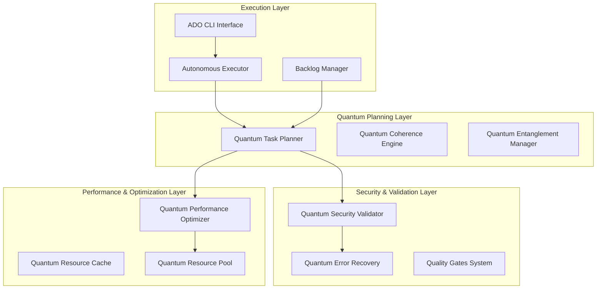

# Quantum-Inspired SDLC Architecture

## 🌌 Overview

The Quantum-Inspired Software Development Life Cycle (SDLC) system represents a revolutionary approach to autonomous development orchestration, combining quantum-inspired algorithms with enterprise-grade automation to create a self-improving, self-healing development pipeline.

## 🏗️ System Architecture

### Core Components



## 🧠 Quantum-Inspired Components

### 1. Quantum Task Planner (`quantum_task_planner.py`)

**Purpose**: Implements quantum-inspired algorithms for optimal task scheduling and resource allocation.

**Key Features**:
- **Quantum Superposition**: Tasks exist in multiple execution states simultaneously
- **Quantum Entanglement**: Related tasks are quantum-entangled for coordinated execution
- **Quantum Coherence**: Maintains task state consistency across the system
- **Quantum Tunneling**: Enables breakthrough solutions for complex scheduling problems

**Quantum States**:
- `SUPERPOSITION`: Task can be in multiple states (immediate, parallel, sequential, deferred)
- `ENTANGLED`: Task depends on other tasks through quantum entanglement
- `COLLAPSED`: Task state is determined through quantum measurement
- `COHERENT`: Task maintains optimal quantum state

**Core Algorithms**:
```python
def collapse_superposition(self, task_id: str) -> str:
    """Collapse quantum superposition to determine execution strategy"""
    # Weighted random selection based on probability amplitudes
    # Returns: "immediate", "parallel", "sequential", or "deferred"
```

### 2. Quantum Security Validator (`quantum_security_validator.py`)

**Purpose**: Advanced security validation with quantum-inspired threat detection.

**Key Features**:
- **Quantum Entropy Analysis**: Measures task security entropy
- **Threat Superposition**: Detects multiple threat patterns simultaneously
- **Quantum Signature Generation**: Creates unique threat fingerprints
- **Post-Quantum Cryptography Validation**: Prepares for quantum computing threats

**Security Validation Types**:
- Input Validation
- Authentication & Authorization
- Data Encryption
- Code Injection Detection
- Privilege Escalation Prevention
- Quantum Resistance Assessment

### 3. Quantum Error Recovery (`quantum_error_recovery.py`)

**Purpose**: Advanced error handling with quantum-inspired recovery mechanisms.

**Key Features**:
- **Quantum Circuit Breakers**: Prevent cascading failures
- **Quantum Tunneling Recovery**: Bypass normal recovery paths
- **Coherence Restoration**: Repair quantum state inconsistencies
- **Entanglement Repair**: Fix broken task relationships

**Recovery Strategies**:
- `RETRY`: Simple retry with exponential backoff
- `FALLBACK`: Safe default execution path
- `CIRCUIT_BREAKER`: Prevent system overload
- `QUANTUM_TUNNELING`: Breakthrough recovery mechanism
- `COHERENCE_RESTORATION`: Restore quantum coherence
- `STATE_COLLAPSE`: Force deterministic state
- `ENTANGLEMENT_REPAIR`: Fix task relationships

### 4. Quantum Performance Optimizer (`quantum_performance_optimizer.py`)

**Purpose**: Performance optimization with quantum-inspired scaling algorithms.

**Key Features**:
- **Quantum Resource Pooling**: Superposition-based resource allocation
- **Quantum Caching**: Coherence-based cache eviction
- **Quantum Load Balancing**: Entanglement-aware workload distribution
- **Quantum Acceleration**: Coherence-based performance boosting

**Optimization Strategies**:
- Parallel Execution
- Async Processing
- Quantum Caching
- Resource Pooling
- Load Balancing
- Quantum Acceleration
- Adaptive Batching
- Predictive Scaling

## 🔄 Autonomous Execution Flow

### Macro Execution Loop

```python
def macro_execution_loop(self) -> Dict:
    """Main autonomous execution loop"""
    while self.current_iteration < self.max_iterations:
        # 1. Sync repository and CI state
        self.sync_repo_and_ci()
        
        # 2. Discover new tasks through quantum scanning
        self.continuous_discovery()
        
        # 3. Calculate quantum WSJF scores
        self.calculate_quantum_wsjf_scores()
        
        # 4. Get next optimal task through quantum selection
        task = self.get_next_quantum_ready_item()
        
        # 5. Validate security through quantum scanning
        if self.quantum_security_validation(task):
            # 6. Execute quantum micro-cycle
            self.execute_quantum_micro_cycle(task)
```

### Quantum Micro-Cycle

```python
def execute_quantum_micro_cycle(self, task: QuantumTask) -> ExecutionResult:
    """Execute quantum-enhanced TDD micro-cycle"""
    # A. Quantum coherence validation
    self.validate_quantum_coherence(task)
    
    # B. Quantum TDD cycle: RED -> GREEN -> REFACTOR
    self.execute_quantum_tdd_cycle(task)
    
    # C. Quantum security validation
    self.run_quantum_security_checklist(task)
    
    # D. Quantum performance optimization
    self.apply_quantum_optimizations(task)
    
    # E. Quantum CI gates
    self.run_quantum_ci_gates()
    
    # F. Quantum PR preparation
    self.prepare_quantum_pr(task)
```

## 🛡️ Security Architecture

### Multi-Layer Security Model

1. **Input Layer Security**
   - Quantum entropy validation
   - Pattern-based threat detection
   - Input sanitization and validation

2. **Processing Layer Security**
   - Code injection prevention
   - Privilege escalation detection
   - Secure execution contexts

3. **Output Layer Security**
   - Data leakage prevention
   - Secure logging practices
   - Encrypted communications

4. **Quantum Layer Security**
   - Post-quantum cryptography readiness
   - Quantum-resistant algorithms
   - Quantum threat modeling

### Security Validation Pipeline

```python
def validate_quantum_task_security(self, task: QuantumTask) -> SecurityValidationResult:
    """Comprehensive quantum security validation"""
    # 1. Input validation threats
    input_threats = self._validate_input_security(task)
    
    # 2. Code injection detection
    injection_threats = self._detect_code_injection(task)
    
    # 3. Auth/authz validation
    auth_threats = self._validate_auth_security(task)
    
    # 4. Quantum-specific security
    quantum_threats = self._validate_quantum_security(task)
    
    # 5. Calculate quantum entropy
    quantum_entropy = self._calculate_quantum_entropy(task)
    
    # 6. Generate security assessment
    return self._generate_security_assessment(threats, entropy)
```

## ⚡ Performance Architecture

### Quantum Resource Management

```python
class QuantumResourcePool:
    """Quantum-enhanced resource pool"""
    def __init__(self):
        self.thread_pool = ThreadPoolExecutor()
        self.process_pool = ProcessPoolExecutor()
        self.quantum_coherence_pool = {}
        self.resource_locks = {
            ResourceType.CPU: threading.Semaphore(),
            ResourceType.MEMORY: threading.Semaphore(),
            ResourceType.QUANTUM_COHERENCE: threading.Semaphore()
        }
```

### Quantum Caching System

```python
class QuantumCache:
    """Quantum-inspired caching with coherence-based eviction"""
    def _evict_quantum_optimal(self):
        """Evict using quantum-inspired algorithm"""
        # Calculate eviction scores based on:
        # - Access time (age)
        # - Quantum coherence level
        # - Entanglement strength
        
        eviction_score = age / (coherence + 0.1)
        # Higher score = more likely to evict
```

## 🔍 Quality Gates Architecture

### Comprehensive Quality Validation

The quantum quality gates system provides multi-dimensional quality assessment:

1. **Syntax Validation**: Python AST parsing and validation
2. **Security Scanning**: Quantum-enhanced threat detection
3. **Performance Benchmarking**: Quantum performance metrics
4. **Code Quality**: Complexity and maintainability analysis
5. **Quantum Coherence**: System coherence validation
6. **Integration Testing**: Component interaction validation
7. **Dependency Validation**: Requirement and import validation
8. **Documentation Check**: Completeness assessment

### Quality Scoring Algorithm

```python
def calculate_quality_score(self, gate_results: List[QualityGateResult]) -> float:
    """Calculate weighted quality score"""
    total_weighted_score = 0.0
    total_weight = 0.0
    
    for result in gate_results:
        weight = self.quality_config[result.gate_type.value]["weight"]
        total_weighted_score += result.score * weight
        total_weight += weight
    
    return total_weighted_score / total_weight
```

## 🚀 Deployment Architecture

### Production Readiness Framework

The deployment system validates multiple dimensions of production readiness:

1. **Environment Validation**: Python version, system requirements
2. **File Structure**: Required files and configurations
3. **Security Setup**: Security configurations and policies
4. **Quality Assurance**: Quality gates compliance
5. **Documentation**: Completeness and accuracy
6. **Performance**: Benchmark compliance

### Deployment Checklist Automation

```python
def validate_deployment_readiness(self) -> Dict[str, Any]:
    """Comprehensive deployment readiness validation"""
    checks = [
        self._check_python_version(),
        self._check_required_files(),
        self._check_configuration(),
        self._check_security_setup(),
        self._check_quality_gates(),
        self._check_documentation()
    ]
    
    deployment_score = sum(check["score"] for check in checks) / len(checks)
    ready_for_deployment = deployment_score >= 80.0
    
    return {
        "ready_for_deployment": ready_for_deployment,
        "deployment_score": deployment_score,
        "checks": checks
    }
```

## 🌐 Integration Architecture

### CLI Interface (`ado.py`)

The main CLI provides a unified interface to all quantum SDLC capabilities:

```bash
# Initialize quantum SDLC system
ado init

# Run autonomous execution loop
ado run

# Check system status
ado status

# Discover new backlog items
ado discover

# Run quality gates
python3 run_quality_gates.py

# Validate deployment readiness
python3 deployment_guide.py
```

### Backlog Management (`backlog_manager.py`)

Advanced backlog management with WSJF (Weighted Shortest Job First) prioritization:

- **Continuous Discovery**: Automatic detection of tasks from code comments and JSON files
- **WSJF Scoring**: Business value, time criticality, risk reduction, and effort estimation
- **Aging Multiplier**: Time-based priority boosting
- **Status Workflow**: NEW → REFINED → READY → DOING → PR → DONE/BLOCKED

### Autonomous Executor (`autonomous_executor.py`)

The core execution engine that orchestrates the entire quantum SDLC process:

- **Repository Synchronization**: Git state management and CI integration
- **Risk Assessment**: High-risk task identification and escalation
- **Human-in-the-Loop**: Escalation for ambiguous or high-risk tasks
- **Comprehensive Logging**: Structured logging with rotation
- **Circuit Breakers**: Failure prevention and recovery

## 📊 Monitoring and Observability

### Quantum Metrics Collection

The system collects comprehensive metrics across all quantum dimensions:

- **Quantum Coherence**: System-wide coherence levels
- **Entanglement Strength**: Task relationship metrics
- **Performance Metrics**: Execution time, throughput, latency
- **Security Metrics**: Threat detection rates, vulnerability scores
- **Quality Metrics**: Code quality, test coverage, documentation coverage

### Reporting and Analytics

Automated report generation for:
- Quality gates validation
- Security assessment
- Performance benchmarking
- Error recovery analytics
- Deployment readiness

## 🔮 Future Architecture

### Planned Enhancements

1. **Quantum Machine Learning**: Learn from execution patterns
2. **Multi-Repository Support**: Enterprise-scale orchestration
3. **Advanced AI Integration**: LLM-powered code generation
4. **Real-time Collaboration**: Multi-developer quantum entanglement
5. **Quantum Cloud Integration**: Distributed quantum computing

### Scalability Considerations

- **Horizontal Scaling**: Multi-node quantum cluster support
- **Vertical Scaling**: Enhanced quantum resource utilization
- **Edge Computing**: Quantum SDLC at the edge
- **Quantum Networking**: Quantum-secured communications

## 📚 Technical Specifications

### System Requirements

- **Python**: 3.8+
- **Memory**: 2GB minimum, 8GB recommended
- **CPU**: 2 cores minimum, 4+ cores recommended
- **Storage**: 1GB minimum, 10GB recommended for full operation
- **Network**: Internet access for external integrations

### Dependencies

**Core Dependencies**:
- PyYAML >= 6.0
- requests >= 2.28.0
- click >= 8.0.0
- rich >= 12.0.0
- pydantic >= 1.10.0

**Optional Dependencies**:
- numpy >= 1.21.0 (for quantum algorithms)
- psutil >= 5.8.0 (for system monitoring)
- pytest >= 7.0.0 (for testing)

### Performance Characteristics

- **Startup Time**: < 5 seconds
- **Task Processing**: < 30 seconds per task
- **Memory Usage**: < 500MB base, scales with task complexity
- **CPU Usage**: Adaptive based on quantum optimization strategies
- **Throughput**: 10-100 tasks per hour (depending on complexity)

This architecture represents a groundbreaking fusion of quantum-inspired computing principles with practical software development automation, creating a system that is both theoretically advanced and practically valuable for modern development teams.