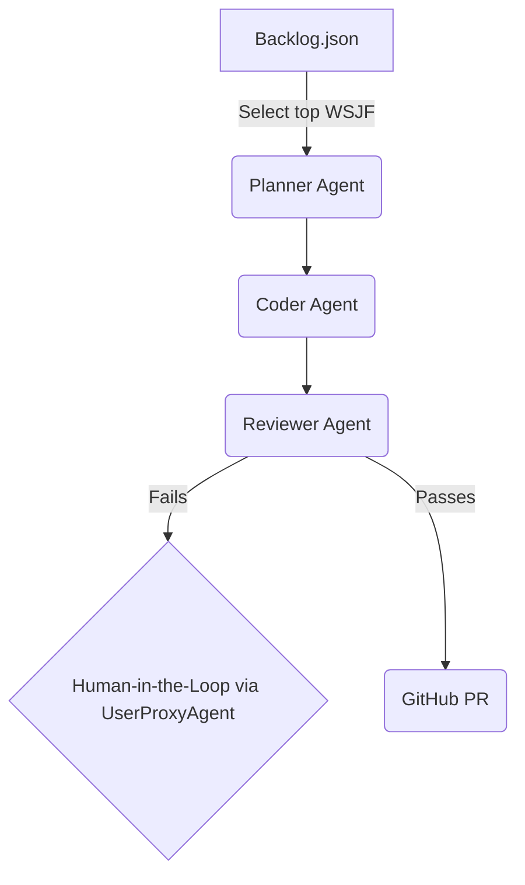

# agentic-dev-orchestrator

[](https://github.com/danieleschmidt/agentic-dev-orchestrator/actions)
[](https://codecov.io/gh/danieleschmidt/agentic-dev-orchestrator)
[](LICENSE)
[](https://pypi.org/project/agentic-dev-orchestrator/)
[](https://semver.org)
[](docs/security/)
[](docs/operations/)

A comprehensive CLI and GitHub Action that unifies multi-agent development workflows with enterprise-grade SDLC automation. Integrates frameworks like AutoGen and CrewAI with complete CI/CD, security scanning, monitoring, and automated maintenance capabilities.

## ✨ Key Features

### 🤖 Multi-Agent Orchestration
*   **WSJF-Ranked Backlog**: Ingests `backlog/*.json` files, prioritizing tasks using the full SAFe WSJF formula
*   **Multi-Agent Execution Graph**: Pipeline of AI agents—Planner, Coder, Reviewer, and Merger—using AutoGen
*   **Safety & Escalation Hooks**: Policy gates, test coverage checks, and human-in-the-loop patterns

### 🛡️ Enterprise-Grade Security
*   **Comprehensive Security Scanning**: Bandit, Safety, Semgrep, TruffleHog, GitLeaks integration
*   **Container Security**: Trivy and Snyk scanning for Docker images
*   **Dependency Vulnerability Management**: Automated security updates and compliance checking
*   **Secret Detection**: Multi-tool secret scanning with SARIF reporting

### 🔄 Complete CI/CD Pipeline
*   **Automated Testing**: Multi-Python version testing with coverage reporting
*   **Quality Gates**: Code linting, formatting, type checking with configurable thresholds
*   **Automated Deployment**: PyPI and container registry publishing with semantic versioning
*   **Branch Protection**: Configurable protection rules with required status checks

### 📊 Monitoring & Observability
*   **Health Monitoring**: Comprehensive repository health checks and scoring
*   **Metrics Collection**: Automated collection of code quality, security, and performance metrics
*   **Trend Analysis**: Historical tracking with alerts and recommendations
*   **Prometheus Integration**: Ready for production monitoring with custom metrics

### 🔧 Automated Maintenance
*   **Dependency Updates**: Automated dependency management with security validation
*   **Code Quality Maintenance**: Automated cleanup, optimization, and health reporting
*   **Documentation Generation**: Automated docs updates and compliance reporting
*   **Performance Optimization**: Build time optimization and resource monitoring

## 🏗️ Architecture



## ⚡ Quick Start

### Installation

**Via pip (recommended):**
```bash
pip install agentic-dev-orchestrator
```

**Via Docker:**
```bash
docker pull ghcr.io/danieleschmidt/agentic-dev-orchestrator:latest
docker run --rm -v $(pwd):/workspace -w /workspace agentic-dev-orchestrator:latest ado --help
```

**From source:**
```bash
git clone https://github.com/danieleschmidt/agentic-dev-orchestrator.git
cd agentic-dev-orchestrator
pip install -e .
```

### Shell Completions (Optional)

For better CLI experience, install shell completions:
```bash
# After installing from source
./install-completions.sh

# Or manually for your shell:
# Bash: source completions/ado.bash
# Zsh: copy completions/ado.zsh to your fpath
# Fish: copy completions/ado.fish to ~/.config/fish/completions/
```

### Core Usage

```bash
# Initialize the project  
ado init

# Set your environment variables
export GITHUB_TOKEN='your_personal_access_token'
export OPENAI_API_KEY='your_openai_api_key'

# Run the orchestrator
ado run
```

### SDLC Automation Usage

```bash
# Run comprehensive health check
./scripts/run_automation.sh health

# Collect project metrics
./scripts/run_automation.sh metrics

# Run maintenance tasks
./scripts/run_automation.sh maintenance

# Update dependencies with maintenance
./scripts/run_automation.sh maintenance --update-deps

# Run all automation tasks
./scripts/run_automation.sh all

# Setup automation dependencies
./scripts/run_automation.sh setup
```
## 🛠️ Configuration

### Core Agent Configuration

**Backlog Schema** (`backlog/issue-123.json`):
```json
{
  "title": "Implement user authentication endpoint",
  "wsjf": {
    "user_business_value": 8,
    "time_criticality": 8,
    "risk_reduction_opportunity_enablement": 5,
    "job_size": 5
  },
  "description": "Create a new FastAPI endpoint at /auth/login."
}
```

### SDLC Configuration

**Metrics Configuration** (`.github/project-metrics.json`):
- Code quality thresholds and targets
- Security scanning configuration
- Performance benchmarks
- Development process metrics
- Automation settings and integrations

**Development Environment** (`.devcontainer/devcontainer.json`):
- Consistent development environment setup
- Pre-configured tools and extensions
- Automated setup for new contributors

**Quality Gates** (configured in workflows):
- Minimum test coverage: 80%
- Maximum complexity score: 10
- Zero critical security vulnerabilities
- All code must pass linting and formatting

### Environment Variables

| Variable | Description | Required |
|----------|-------------|----------|
| `GITHUB_TOKEN` | GitHub Personal Access Token for PR creation | ✅ |
| `OPENAI_API_KEY` | API key for LLM agents | ✅ |
| `SEMGREP_APP_TOKEN` | Semgrep security scanning token | ⚠️ |
| `SNYK_TOKEN` | Snyk vulnerability scanning token | ⚠️ |
| `CODECOV_TOKEN` | Code coverage reporting token | ⚠️ |

## 📈 Roadmap

- **v0.1.0** ✅: Single-repository projects with complete SDLC automation
- **v0.2.0** 🚧: Monorepo support with `ado.yml` configuration discovery
- **v0.3.0** 📋: Advanced AI model integration and custom agent pipelines
- **v1.0.0** 🎯: SaaS dashboard for workflow management and analytics
## 📖 Documentation

### Getting Started
- **[Quick Start Guide](QUICKSTART.md)** - Get started in 5 minutes
- **[Manual Setup Guide](MANUAL_SETUP_REQUIRED.md)** - ⚠️ GitHub Actions setup instructions
- **[Development Guide](docs/DEVELOPMENT.md)** - Local development setup

### Architecture & Operations
- **[Architecture Overview](ARCHITECTURE.md)** - System design and components
- **[SDLC Operations](docs/operations/)** - Monitoring, observability, and SRE
- **[Security Documentation](docs/security/)** - Security policies and compliance
- **[Deployment Guide](docs/deployment/)** - Production deployment instructions

### Development
- **[Contributing Guide](CONTRIBUTING.md)** - How to contribute to the project
- **[Testing Guide](docs/testing/)** - Testing strategies and guidelines
- **[Troubleshooting](docs/troubleshooting/)** - Common issues and solutions

### Workflows & Automation
- **[GitHub Actions Setup](docs/workflows/)** - CI/CD workflow configuration
- **[Automation Scripts](scripts/)** - Maintenance and monitoring automation
- **[Architecture Decision Records](docs/adr/)** - Design decisions and rationale

🤝 Contributing
We welcome contributions! Please see our [CONTRIBUTING.md](CONTRIBUTING.md) for guidelines and our [CODE_OF_CONDUCT.md](CODE_OF_CONDUCT.md). A [CHANGELOG.md](CHANGELOG.md) is maintained for version history.

## See Also
- **[observer-coordinator-insights](https://github.com/danieleschmidt/observer-coordinator-insights)** - Uses this orchestration layer for HR analytics
📝 License
This project is licensed under the Apache-2.0 License.
📚 References
AutoGen Human-in-the-Loop: AutoGen UserProxyAgent Docs
SAFe WSJF: Scaled Agile Framework Documentation
