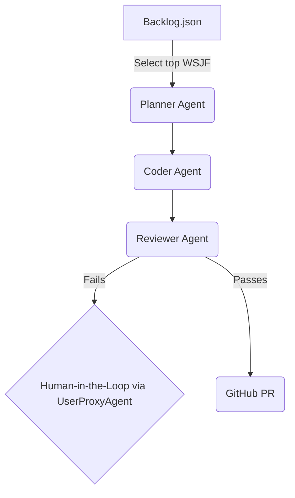

# agentic-dev-orchestrator

[](https://github.com/danieleschmidt/agentic-dev-orchestrator/actions)
[](https://codecov.io/gh/danieleschmidt/agentic-dev-orchestrator)
[](LICENSE)
[](https://pypi.org/project/agentic-dev-orchestrator/)
[](https://semver.org)

A CLI and GitHub Action that unifies multi-agent development workflows, integrating frameworks like AutoGen and CrewAI. It streamlines the coding process by automatically ranking tasks from a backlog using the Weighted Shortest Job First (WSJF) method and executing them through a sequence of specialized AI agents.

## ✨ Key Features

*   **WSJF-Ranked Backlog**: Ingests `backlog/*.json` files, prioritizing tasks using the full SAFe WSJF formula: `(User-Business Value + Time Criticality + Risk Reduction & Opportunity Enablement) / Job Size`.
*   **Multi-Agent Execution Graph**: Implements a pipeline of AI agents—Planner, Coder, Reviewer, and Merger—using AutoGen's communication channels.
*   **Safety & Escalation Hooks**: Includes a policy gate, unit-test coverage checks, and a human-in-the-loop pattern for resolving edge cases. This pattern is implemented via AutoGen's `UserProxyAgent`.

## 🏗️ Architecture



⚡ Quick Start

### Installation

**Via pip (recommended):**
```bash
pip install agentic-dev-orchestrator
```

**Via Docker:**
```bash
docker pull ghcr.io/danieleschmidt/agentic-dev-orchestrator:latest
docker run --rm -v $(pwd):/workspace -w /workspace agentic-dev-orchestrator:latest ado --help
```

**From source:**
```bash
git clone https://github.com/danieleschmidt/agentic-dev-orchestrator.git
cd agentic-dev-orchestrator
pip install -e .
```

### Shell Completions (Optional)

For better CLI experience, install shell completions:
```bash
# After installing from source
./install-completions.sh

# Or manually for your shell:
# Bash: source completions/ado.bash
# Zsh: copy completions/ado.zsh to your fpath
# Fish: copy completions/ado.fish to ~/.config/fish/completions/
```

### Usage

```bash
# Initialize the project  
ado init

# Set your environment variables
export GITHUB_TOKEN='your_personal_access_token'
export OPENAI_API_KEY='your_openai_api_key'

# Run the orchestrator
ado run
```
🛠️ Configuration
Backlog Schema backlog/issue-123.json
```{
  "title": "Implement user authentication endpoint",
  "wsjf": {
    "user_business_value": 8,
    "time_criticality": 8,
    "risk_reduction_opportunity_enablement": 5,
    "job_size": 5
  },
  "description": "Create a new FastAPI endpoint at /auth/login."
}
```

Environment Variables
Variable	Description
GITHUB_TOKEN	A GitHub Personal Access Token for creating PRs.
OPENAI_API_KEY	API key for the underlying LLM used by the agents.
📈 Roadmap
v0.1.0: Support for single-repository projects.
v0.2.0 (Monorepo Support): The orchestrator will discover sub-projects by looking for ado.yml configuration files in subdirectories.
v1.0.0: SaaS dashboard for managing workflows.
## 📖 Documentation

- **[Quick Start Guide](QUICKSTART.md)** - Get started in 5 minutes
- **[Manual Setup Required](MANUAL_SETUP_REQUIRED.md)** - ⚠️ GitHub Actions setup instructions
- **[Architecture Overview](ARCHITECTURE.md)** - System design and components
- **[Contributing Guide](CONTRIBUTING.md)** - How to contribute
- **[Security Policy](SECURITY.md)** - Security considerations
- **[Full Documentation](docs/)** - Complete documentation

🤝 Contributing
We welcome contributions! Please see our [CONTRIBUTING.md](CONTRIBUTING.md) for guidelines and our [CODE_OF_CONDUCT.md](CODE_OF_CONDUCT.md). A [CHANGELOG.md](CHANGELOG.md) is maintained for version history.

## See Also
- **[observer-coordinator-insights](https://github.com/danieleschmidt/observer-coordinator-insights)** - Uses this orchestration layer for HR analytics
📝 License
This project is licensed under the Apache-2.0 License.
📚 References
AutoGen Human-in-the-Loop: AutoGen UserProxyAgent Docs
SAFe WSJF: Scaled Agile Framework Documentation
