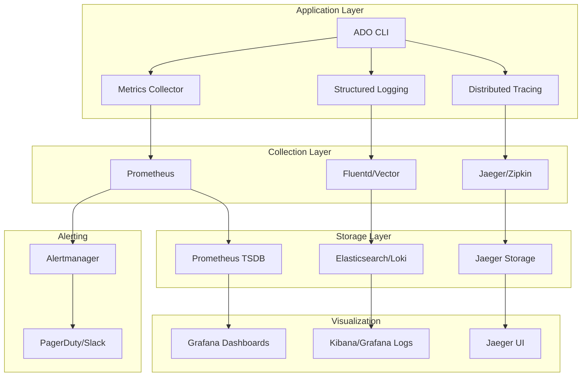

# Observability Implementation Guide

## Overview

This document outlines the comprehensive observability strategy for the agentic-dev-orchestrator, including monitoring, logging, tracing, and alerting implementations.

## Architecture



## Metrics Implementation

### 1. Application Metrics

```python
# ado/monitoring/metrics.py
from prometheus_client import Counter, Histogram, Gauge, start_http_server
import time
import functools

# Custom metrics for ADO
TASK_EXECUTIONS = Counter(
    'ado_task_executions_total',
    'Total number of task executions',
    ['task_type', 'status']
)

TASK_DURATION = Histogram(
    'ado_task_duration_seconds',
    'Time spent executing tasks',
    ['task_type'],
    buckets=[0.1, 0.5, 1.0, 2.5, 5.0, 10.0, 30.0, 60.0, 120.0, float('inf')]
)

ACTIVE_AGENTS = Gauge(
    'ado_active_agents',
    'Number of active agents',
    ['agent_type']
)

WSJF_SCORES = Histogram(
    'ado_wsjf_scores',
    'WSJF scores distribution',
    ['task_priority'],
    buckets=[0, 10, 20, 50, 100, 200, 500, 1000, float('inf')]
)

BACKLOG_SIZE = Gauge(
    'ado_backlog_size',
    'Current backlog size',
    ['status']
)

def monitor_task_execution(task_type: str):
    """Decorator to monitor task execution."""
    def decorator(func):
        @functools.wraps(func)
        def wrapper(*args, **kwargs):
            start_time = time.time()
            ACTIVE_AGENTS.labels(agent_type=task_type).inc()
            
            try:
                result = func(*args, **kwargs)
                TASK_EXECUTIONS.labels(task_type=task_type, status='success').inc()
                return result
            except Exception as e:
                TASK_EXECUTIONS.labels(task_type=task_type, status='error').inc()
                raise
            finally:
                duration = time.time() - start_time
                TASK_DURATION.labels(task_type=task_type).observe(duration)
                ACTIVE_AGENTS.labels(agent_type=task_type).dec()
        
        return wrapper
    return decorator

class MetricsServer:
    """Prometheus metrics server for ADO."""
    
    def __init__(self, port: int = 8000):
        self.port = port
        self.server_started = False
    
    def start(self):
        """Start the metrics server."""
        if not self.server_started:
            start_http_server(self.port)
            self.server_started = True
            print(f"Metrics server started on port {self.port}")
    
    def update_backlog_metrics(self, backlog_items):
        """Update backlog-related metrics."""
        status_counts = {}
        wsjf_scores = []
        
        for item in backlog_items:
            status = item.get('status', 'unknown')
            status_counts[status] = status_counts.get(status, 0) + 1
            
            if 'wsjf_score' in item:
                wsjf_scores.append(item['wsjf_score'])
                priority = 'high' if item['wsjf_score'] > 100 else 'low'
                WSJF_SCORES.labels(task_priority=priority).observe(item['wsjf_score'])
        
        for status, count in status_counts.items():
            BACKLOG_SIZE.labels(status=status).set(count)
```

### 2. Enhanced Prometheus Configuration

```yaml
# monitoring/prometheus/prometheus-enhanced.yml
global:
  scrape_interval: 15s
  evaluation_interval: 15s
  external_labels:
    cluster: 'ado-production'
    replica: 'prometheus-1'

rule_files:
  - "rules/*.yml"

alerting:
  alertmanagers:
    - static_configs:
        - targets:
          - alertmanager:9093

scrape_configs:
  # ADO Application Metrics
  - job_name: 'ado-app'
    static_configs:
      - targets: ['localhost:8000']
    metrics_path: /metrics
    scrape_interval: 5s
    scrape_timeout: 5s
    
  # Node Exporter for System Metrics
  - job_name: 'node-exporter'
    static_configs:
      - targets: ['node-exporter:9100']
    
  # Container Metrics
  - job_name: 'cadvisor'
    static_configs:
      - targets: ['cadvisor:8080']
  
  # Python Process Metrics
  - job_name: 'python-process'
    static_configs:
      - targets: ['localhost:8001']
    metrics_path: /metrics
    
  # GitHub API Metrics (if applicable)
  - job_name: 'github-exporter'
    static_configs:
      - targets: ['github-exporter:9171']
    scrape_interval: 30s

# Remote write configuration for long-term storage
remote_write:
  - url: "https://prometheus-remote-write-endpoint.example.com/api/v1/write"
    basic_auth:
      username: "prometheus"
      password_file: "/etc/prometheus/remote-write-password"

# Remote read configuration
remote_read:
  - url: "https://prometheus-remote-read-endpoint.example.com/api/v1/read"
    read_recent: true
```

## Logging Implementation

### 1. Structured Logging Configuration

```python
# ado/monitoring/logging.py
import structlog
import logging
import sys
from pythonjsonlogger import jsonlogger
from typing import Any, Dict

def configure_logging(
    log_level: str = "INFO",
    json_format: bool = True,
    include_timestamp: bool = True
) -> None:
    """Configure structured logging for ADO."""
    
    # Configure structlog
    structlog.configure(
        processors=[
            structlog.stdlib.filter_by_level,
            structlog.stdlib.add_logger_name,
            structlog.stdlib.add_log_level,
            structlog.stdlib.PositionalArgumentsFormatter(),
            structlog.processors.TimeStamper(fmt="iso"),
            structlog.processors.StackInfoRenderer(),
            structlog.processors.format_exc_info,
            structlog.processors.UnicodeDecoder(),
            structlog.processors.JSONRenderer() if json_format else structlog.dev.ConsoleRenderer(),
        ],
        context_class=dict,
        logger_factory=structlog.stdlib.LoggerFactory(),
        wrapper_class=structlog.stdlib.BoundLogger,
        cache_logger_on_first_use=True,
    )
    
    # Configure standard library logging
    if json_format:
        formatter = jsonlogger.JsonFormatter()
    else:
        formatter = logging.Formatter(
            '%(asctime)s - %(name)s - %(levelname)s - %(message)s'
        )
    
    handler = logging.StreamHandler(sys.stdout)
    handler.setFormatter(formatter)
    
    root_logger = logging.getLogger()
    root_logger.addHandler(handler)
    root_logger.setLevel(getattr(logging, log_level.upper()))

class ADOLogger:
    """Enhanced logger with context management."""
    
    def __init__(self, name: str):
        self.logger = structlog.get_logger(name)
        self._context: Dict[str, Any] = {}
    
    def bind(self, **kwargs) -> 'ADOLogger':
        """Bind context to logger."""
        new_logger = ADOLogger(self.logger.name)
        new_logger._context = {**self._context, **kwargs}
        new_logger.logger = self.logger.bind(**new_logger._context)
        return new_logger
    
    def info(self, msg: str, **kwargs):
        self.logger.info(msg, **kwargs)
    
    def error(self, msg: str, **kwargs):
        self.logger.error(msg, **kwargs)
    
    def warning(self, msg: str, **kwargs):
        self.logger.warning(msg, **kwargs)
    
    def debug(self, msg: str, **kwargs):
        self.logger.debug(msg, **kwargs)
    
    def log_task_start(self, task_id: str, task_type: str, **context):
        """Log task start with context."""
        self.bind(
            task_id=task_id,
            task_type=task_type,
            **context
        ).info("Task started")
    
    def log_task_complete(self, task_id: str, duration: float, **context):
        """Log task completion with metrics."""
        self.bind(
            task_id=task_id,
            duration_seconds=duration,
            **context
        ).info("Task completed")
    
    def log_error(self, error: Exception, task_id: str = None, **context):
        """Log error with full context."""
        error_context = {
            'error_type': type(error).__name__,
            'error_message': str(error),
            **context
        }
        if task_id:
            error_context['task_id'] = task_id
            
        self.bind(**error_context).error("Task failed with error")

# Usage example
logger = ADOLogger("ado.main")
task_logger = logger.bind(component="task_executor", version="0.1.0")
```

### 2. Log Shipping Configuration

```yaml
# monitoring/vector/vector.toml
[sources.ado_logs]
type = "file"
include = ["/var/log/ado/*.log", "/app/logs/*.log"]
ignore_older_secs = 600

[transforms.parse_json]
type = "remap"
inputs = ["ado_logs"]
source = """
. = parse_json!(.message)
.timestamp = parse_timestamp!(.timestamp, format: "%Y-%m-%dT%H:%M:%S%.fZ")
"""

[transforms.add_metadata]
type = "remap"
inputs = ["parse_json"]
source = """
.service = "ado"
.environment = "${ENVIRONMENT:-development}"
.version = "${ADO_VERSION:-unknown}"
.hostname = "${HOSTNAME}"
"""

[sinks.elasticsearch]
type = "elasticsearch"
inputs = ["add_metadata"]
endpoints = ["https://elasticsearch.example.com:9200"]
index = "ado-logs-%Y.%m.%d"

[sinks.loki]
type = "loki"
inputs = ["add_metadata"]
endpoint = "https://loki.example.com:3100"
labels = {service = "ado", environment = "${ENVIRONMENT}"}

[sinks.console]
type = "console"
inputs = ["add_metadata"]
target = "stdout"
encoding.codec = "json"
```

## Distributed Tracing

### 1. OpenTelemetry Integration

```python
# ado/monitoring/tracing.py
from opentelemetry import trace
from opentelemetry.exporter.jaeger.thrift import JaegerExporter
from opentelemetry.sdk.trace import TracerProvider
from opentelemetry.sdk.trace.export import BatchSpanProcessor
from opentelemetry.instrumentation.requests import RequestsInstrumentor
from opentelemetry.instrumentation.sqlalchemy import SQLAlchemyInstrumentor
import functools

def configure_tracing(service_name: str = "ado", jaeger_endpoint: str = None):
    """Configure OpenTelemetry tracing."""
    
    trace.set_tracer_provider(TracerProvider())
    tracer = trace.get_tracer(__name__)
    
    if jaeger_endpoint:
        jaeger_exporter = JaegerExporter(
            agent_host_name="localhost",
            agent_port=6831,
            collector_endpoint=jaeger_endpoint,
        )
        
        span_processor = BatchSpanProcessor(jaeger_exporter)
        trace.get_tracer_provider().add_span_processor(span_processor)
    
    # Instrument common libraries
    RequestsInstrumentor().instrument()
    SQLAlchemyInstrumentor().instrument()
    
    return tracer

def trace_function(operation_name: str = None):
    """Decorator to trace function execution."""
    def decorator(func):
        @functools.wraps(func)
        def wrapper(*args, **kwargs):
            tracer = trace.get_tracer(__name__)
            name = operation_name or f"{func.__module__}.{func.__name__}"
            
            with tracer.start_as_current_span(name) as span:
                # Add function arguments as attributes
                span.set_attribute("function.name", func.__name__)
                span.set_attribute("function.module", func.__module__)
                
                try:
                    result = func(*args, **kwargs)
                    span.set_attribute("function.result.success", True)
                    return result
                except Exception as e:
                    span.set_attribute("function.result.success", False)
                    span.set_attribute("function.error.type", type(e).__name__)
                    span.set_attribute("function.error.message", str(e))
                    span.record_exception(e)
                    raise
        
        return wrapper
    return decorator

class TracingContext:
    """Context manager for tracing operations."""
    
    def __init__(self, operation_name: str, **attributes):
        self.operation_name = operation_name
        self.attributes = attributes
        self.tracer = trace.get_tracer(__name__)
        self.span = None
    
    def __enter__(self):
        self.span = self.tracer.start_span(self.operation_name)
        for key, value in self.attributes.items():
            self.span.set_attribute(key, value)
        return self.span
    
    def __exit__(self, exc_type, exc_val, exc_tb):
        if exc_type is not None:
            self.span.set_attribute("error", True)
            self.span.set_attribute("error.type", exc_type.__name__)
            self.span.set_attribute("error.message", str(exc_val))
            self.span.record_exception(exc_val)
        self.span.end()
```

## Alerting Rules

### 1. Critical Alerts

```yaml
# monitoring/prometheus/rules/critical-alerts.yml
groups:
  - name: ado.critical
    rules:
      - alert: ADOTaskExecutionFailure
        expr: increase(ado_task_executions_total{status="error"}[5m]) > 5
        for: 2m
        labels:
          severity: critical
          service: ado
        annotations:
          summary: "High task failure rate in ADO"
          description: "{{ $value }} task executions failed in the last 5 minutes"
          runbook_url: "https://docs.example.com/runbooks/ado-task-failures"

      - alert: ADOHighLatency
        expr: histogram_quantile(0.95, ado_task_duration_seconds) > 30
        for: 5m
        labels:
          severity: warning
          service: ado
        annotations:
          summary: "ADO task execution latency is high"
          description: "95th percentile latency is {{ $value }}s"

      - alert: ADOBacklogGrowth
        expr: increase(ado_backlog_size{status="pending"}[1h]) > 50
        for: 10m
        labels:
          severity: warning
          service: ado
        annotations:
          summary: "ADO backlog is growing rapidly"
          description: "Backlog has grown by {{ $value }} items in the last hour"

      - alert: ADOMemoryUsage
        expr: process_resident_memory_bytes{job="ado-app"} > 1000000000
        for: 5m
        labels:
          severity: warning
          service: ado
        annotations:
          summary: "ADO memory usage is high"
          description: "Memory usage is {{ $value | humanize }}B"

  - name: ado.infrastructure
    rules:
      - alert: ADOServiceDown
        expr: up{job="ado-app"} == 0
        for: 1m
        labels:
          severity: critical
          service: ado
        annotations:
          summary: "ADO service is down"
          description: "ADO application is not responding to health checks"
          
      - alert: ADODiskSpace
        expr: (node_filesystem_avail_bytes / node_filesystem_size_bytes) < 0.1
        for: 5m
        labels:
          severity: critical
          service: ado
        annotations:
          summary: "Low disk space on ADO server"
          description: "Disk space is {{ $value | humanizePercentage }} full"
```

## Grafana Dashboards

### 1. ADO Operations Dashboard

```json
{
  "dashboard": {
    "title": "ADO Operations Dashboard",
    "tags": ["ado", "operations"],
    "timezone": "browser",
    "panels": [
      {
        "title": "Task Execution Rate",
        "type": "graph",
        "targets": [
          {
            "expr": "rate(ado_task_executions_total[5m])",
            "legendFormat": "{{task_type}} - {{status}}"
          }
        ],
        "yAxes": [
          {
            "label": "Tasks/sec",
            "min": 0
          }
        ]
      },
      {
        "title": "Task Duration Percentiles",
        "type": "graph",
        "targets": [
          {
            "expr": "histogram_quantile(0.50, ado_task_duration_seconds)",
            "legendFormat": "50th percentile"
          },
          {
            "expr": "histogram_quantile(0.95, ado_task_duration_seconds)",
            "legendFormat": "95th percentile"
          },
          {
            "expr": "histogram_quantile(0.99, ado_task_duration_seconds)",
            "legendFormat": "99th percentile"
          }
        ]
      },
      {
        "title": "Active Agents",
        "type": "singlestat",
        "targets": [
          {
            "expr": "sum(ado_active_agents)",
            "legendFormat": "Active Agents"
          }
        ]
      },
      {
        "title": "Backlog Status",
        "type": "piechart",
        "targets": [
          {
            "expr": "ado_backlog_size",
            "legendFormat": "{{status}}"
          }
        ]
      }
    ]
  }
}
```

## Health Checks

### 1. Application Health Check

```python
# ado/monitoring/health.py
from typing import Dict, Any
import psutil
import time
from datetime import datetime

class HealthChecker:
    """Comprehensive health checking for ADO."""
    
    def __init__(self):
        self.start_time = time.time()
    
    def check_health(self) -> Dict[str, Any]:
        """Perform comprehensive health check."""
        health_status = {
            "status": "healthy",
            "timestamp": datetime.utcnow().isoformat(),
            "uptime_seconds": time.time() - self.start_time,
            "checks": {}
        }
        
        # System health
        health_status["checks"]["system"] = self._check_system()
        
        # Application health
        health_status["checks"]["application"] = self._check_application()
        
        # Dependencies health
        health_status["checks"]["dependencies"] = self._check_dependencies()
        
        # Determine overall status
        failed_checks = [
            name for name, check in health_status["checks"].items()
            if check["status"] != "healthy"
        ]
        
        if failed_checks:
            health_status["status"] = "degraded" if len(failed_checks) == 1 else "unhealthy"
            health_status["failed_checks"] = failed_checks
        
        return health_status
    
    def _check_system(self) -> Dict[str, Any]:
        """Check system resources."""
        try:
            cpu_percent = psutil.cpu_percent(interval=1)
            memory = psutil.virtual_memory()
            disk = psutil.disk_usage('/')
            
            system_health = {
                "status": "healthy",
                "cpu_percent": cpu_percent,
                "memory_percent": memory.percent,
                "disk_percent": (disk.used / disk.total) * 100
            }
            
            # Check thresholds
            if cpu_percent > 90:
                system_health["status"] = "unhealthy"
                system_health["reason"] = "High CPU usage"
            elif memory.percent > 90:
                system_health["status"] = "unhealthy"  
                system_health["reason"] = "High memory usage"
            elif (disk.used / disk.total) > 0.9:
                system_health["status"] = "unhealthy"
                system_health["reason"] = "Low disk space"
            
            return system_health
            
        except Exception as e:
            return {
                "status": "unhealthy",
                "reason": f"System check failed: {str(e)}"
            }
    
    def _check_application(self) -> Dict[str, Any]:
        """Check application-specific health."""
        try:
            # Check if core components are working
            # This would include checking database connections,
            # external API availability, etc.
            return {
                "status": "healthy",
                "version": "0.1.0",
                "active_tasks": 0  # Placeholder
            }
        except Exception as e:
            return {
                "status": "unhealthy",
                "reason": f"Application check failed: {str(e)}"
            }
    
    def _check_dependencies(self) -> Dict[str, Any]:
        """Check external dependencies."""
        dependencies = {
            "github_api": self._check_github_api(),
            "prometheus": self._check_prometheus()
        }
        
        healthy_deps = sum(1 for dep in dependencies.values() if dep["status"] == "healthy")
        total_deps = len(dependencies)
        
        return {
            "status": "healthy" if healthy_deps == total_deps else "degraded",
            "healthy_dependencies": healthy_deps,
            "total_dependencies": total_deps,
            "details": dependencies
        }
    
    def _check_github_api(self) -> Dict[str, Any]:
        """Check GitHub API connectivity."""
        try:
            # Placeholder for actual GitHub API check
            return {"status": "healthy", "response_time_ms": 150}
        except Exception as e:
            return {"status": "unhealthy", "reason": str(e)}
    
    def _check_prometheus(self) -> Dict[str, Any]:
        """Check Prometheus connectivity."""
        try:
            # Placeholder for actual Prometheus check
            return {"status": "healthy", "metrics_endpoint": "http://localhost:8000/metrics"}
        except Exception as e:
            return {"status": "unhealthy", "reason": str(e)}
```

## Implementation Checklist

### Phase 1: Basic Monitoring (Week 1)
- [ ] Implement application metrics collection
- [ ] Configure Prometheus scraping
- [ ] Set up basic Grafana dashboards
- [ ] Implement structured logging

### Phase 2: Advanced Observability (Week 2-3)  
- [ ] Deploy distributed tracing
- [ ] Configure log aggregation
- [ ] Set up alerting rules
- [ ] Implement health checks

### Phase 3: Production Readiness (Week 4)
- [ ] Configure remote storage
- [ ] Set up monitoring for monitoring
- [ ] Implement SLO/SLA tracking
- [ ] Create runbooks and documentation

## Monitoring Best Practices

1. **Follow the Four Golden Signals**: Latency, Traffic, Errors, Saturation
2. **Use RED Method**: Rate, Errors, Duration for services
3. **Implement USE Method**: Utilization, Saturation, Errors for resources
4. **Practice Observability-Driven Development**: Add instrumentation during development
5. **Create Actionable Alerts**: Every alert should require human action

## References

- [Prometheus Best Practices](https://prometheus.io/docs/practices/)
- [OpenTelemetry Python Documentation](https://opentelemetry-python.readthedocs.io/)
- [Grafana Dashboard Best Practices](https://grafana.com/docs/grafana/latest/best-practices/)
- [Site Reliability Engineering Book](https://sre.google/sre-book/)