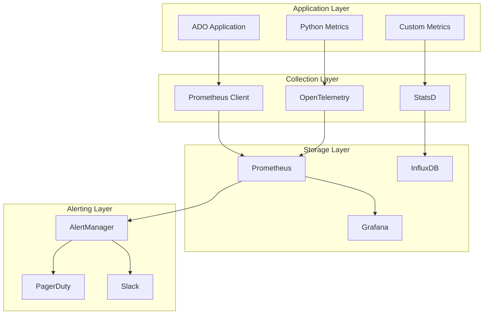

# Performance Monitoring and Optimization

## Overview

This document outlines the performance monitoring, optimization strategies, and operational procedures for the Agentic Development Orchestrator (ADO) to ensure optimal performance and scalability.

## Performance Metrics and KPIs

### Application Performance Indicators

#### Response Time Metrics
- **P50 Response Time**: < 500ms for API requests
- **P95 Response Time**: < 2000ms for API requests  
- **P99 Response Time**: < 5000ms for API requests
- **Agent Execution Time**: P95 < 300 seconds per task

#### Throughput Metrics
- **Requests per Second**: Target 1000 RPS
- **Tasks per Hour**: Target 100 tasks/hour
- **Concurrent Users**: Support 100 concurrent users
- **Agent Throughput**: 10 concurrent agent executions

#### Error Rate Metrics
- **Error Rate**: < 0.1% for API requests
- **Agent Failure Rate**: < 5% for agent executions
- **Timeout Rate**: < 1% for all operations
- **Retry Success Rate**: > 95% for failed operations

### Infrastructure Performance Indicators

#### System Resource Utilization
- **CPU Utilization**: < 70% average, < 90% peak
- **Memory Utilization**: < 80% average, < 95% peak
- **Disk I/O**: < 80% utilization
- **Network I/O**: < 70% bandwidth utilization

#### Database Performance
- **Query Response Time**: P95 < 100ms
- **Connection Pool**: < 80% utilization
- **Lock Wait Time**: < 10ms average
- **Deadlock Rate**: < 0.01% of transactions

## Monitoring Stack Architecture

### Metrics Collection



### Monitoring Components

#### Prometheus Stack
- **Prometheus**: Metrics collection and storage
- **Grafana**: Visualization and dashboards
- **AlertManager**: Alert routing and management
- **Node Exporter**: System metrics collection

#### OpenTelemetry Integration
- **Traces**: Distributed tracing for request flows
- **Metrics**: Application and business metrics
- **Logs**: Structured logging with correlation
- **Context Propagation**: Cross-service correlation

#### Custom Metrics
```python
# ADO-specific metrics
ado_tasks_total = Counter('ado_tasks_total', 'Total tasks processed', ['status'])
ado_agent_duration = Histogram('ado_agent_duration_seconds', 'Agent execution time')
ado_queue_size = Gauge('ado_queue_size', 'Current queue size')
ado_wsjf_score = Histogram('ado_wsjf_score', 'WSJF scores distribution')
```

## Performance Profiling

### Application Profiling

#### Python Profiling Tools
- **cProfile**: CPU profiling for bottleneck identification
- **py-spy**: Sampling profiler for production systems
- **memory_profiler**: Memory usage analysis
- **line_profiler**: Line-by-line performance analysis

#### Profiling Integration
```python
# Development profiling
@profile
def process_backlog_item(item):
    # Function implementation
    pass

# Production profiling with py-spy
# py-spy record -o profile.svg -d 60 -s -p <pid>
```

### Database Profiling

#### Query Performance Analysis
- **Slow Query Log**: Queries taking > 1 second
- **Query Analyzer**: PostgreSQL pg_stat_statements
- **Index Usage**: pg_stat_user_indexes monitoring
- **Connection Monitoring**: pg_stat_activity tracking

#### Database Optimization
```sql
-- Index creation for common queries
CREATE INDEX CONCURRENTLY idx_tasks_status_priority 
ON tasks(status, priority) WHERE status = 'pending';

-- Query performance analysis
EXPLAIN (ANALYZE, BUFFERS) 
SELECT * FROM tasks WHERE priority > 50 ORDER BY created_at;
```

## Performance Optimization Strategies

### Application Optimization

#### Code-Level Optimizations
1. **Algorithm Optimization**: Use efficient algorithms and data structures
2. **Caching Strategy**: Implement multi-level caching
3. **Database Query Optimization**: Optimize queries and indexing
4. **Async Processing**: Use async/await for I/O operations
5. **Resource Pooling**: Connection and thread pooling

#### Caching Implementation
```python
# Redis caching for expensive operations
@lru_cache(maxsize=1000)
def calculate_wsjf_score(task_data):
    # Expensive calculation
    return score

# Database query caching
@cached(cache=TTLCache(maxsize=500, ttl=300))
def get_user_preferences(user_id):
    # Database query
    return preferences
```

### Infrastructure Optimization

#### Horizontal Scaling
- **Load Balancing**: Distribute traffic across instances
- **Auto Scaling**: Dynamic scaling based on metrics
- **Database Sharding**: Distribute data across databases
- **CDN Integration**: Static asset caching

#### Vertical Scaling
- **Resource Allocation**: Optimize CPU and memory allocation
- **Database Tuning**: PostgreSQL configuration optimization
- **JVM Tuning**: If using Java components
- **Container Optimization**: Docker resource limits

### Agent Performance Optimization

#### Agent Execution Optimization
- **Parallel Execution**: Run compatible agents in parallel
- **Resource Limits**: Set memory and CPU limits per agent
- **Timeout Management**: Aggressive timeouts for stuck agents
- **Queue Management**: Priority-based queue processing

#### LLM API Optimization
- **Request Batching**: Batch multiple requests
- **Response Caching**: Cache common responses
- **Model Selection**: Use appropriate model for task complexity
- **Retry Logic**: Exponential backoff for API failures

## Performance Testing

### Load Testing Strategy

#### Test Types
1. **Baseline Testing**: Establish performance baseline
2. **Load Testing**: Normal expected load
3. **Stress Testing**: Peak load scenarios
4. **Spike Testing**: Sudden load increases
5. **Volume Testing**: Large data sets

#### Load Testing Tools
- **Locust**: Python-based load testing
- **Apache JMeter**: GUI-based load testing
- **k6**: JavaScript-based performance testing
- **Artillery**: Node.js load testing toolkit

#### Test Scenarios
```python
# Locust load test example
from locust import HttpUser, task, between

class ADOUser(HttpUser):
    wait_time = between(1, 3)
    
    @task(3)
    def get_backlog_status(self):
        self.client.get("/api/backlog/status")
    
    @task(1)
    def create_task(self):
        self.client.post("/api/tasks", json={"title": "Test task"})
```

### Performance Benchmarking

#### Benchmark Suites
```python
# pytest-benchmark integration
def test_wsjf_calculation_performance(benchmark):
    task_data = generate_test_task_data()
    result = benchmark(calculate_wsjf_score, task_data)
    assert result > 0

# Custom benchmarks
class AgentPerformanceBenchmark:
    def bench_planner_agent(self):
        start_time = time.time()
        result = planner_agent.execute(task)
        duration = time.time() - start_time
        assert duration < 60  # Should complete within 60 seconds
```

## Alerting and Incident Response

### Performance Alerts

#### Critical Alerts (P0)
- **Application Down**: Response time > 30 seconds
- **High Error Rate**: > 5% error rate for 5 minutes
- **Database Down**: Database connection failures
- **Memory Exhaustion**: > 95% memory usage

#### Warning Alerts (P1)
- **High Response Time**: P95 > 5 seconds for 10 minutes
- **High CPU Usage**: > 80% CPU for 15 minutes
- **Disk Space Low**: < 10% free disk space
- **Queue Backlog**: > 1000 pending tasks

#### Info Alerts (P2)
- **Performance Degradation**: 20% slower than baseline
- **Resource Usage Trends**: Increasing resource usage
- **Capacity Planning**: Approaching scaling thresholds

### Incident Response Procedures

#### Performance Incident Playbook
1. **Immediate Response** (0-5 minutes)
   - Check system status dashboards
   - Verify alert accuracy
   - Assess impact scope

2. **Initial Investigation** (5-15 minutes)
   - Check recent deployments
   - Review error logs
   - Identify affected components

3. **Mitigation Actions** (15-30 minutes)
   - Scale up resources if needed
   - Enable circuit breakers
   - Redirect traffic if necessary

4. **Root Cause Analysis** (30+ minutes)
   - Deep dive investigation
   - Performance profiling
   - Identify optimization opportunities

## Capacity Planning

### Growth Projections

#### Traffic Growth Model
- **Current Load**: 100 RPS average
- **Expected Growth**: 20% per quarter
- **Peak Load Multiplier**: 3x average
- **Seasonal Variations**: 50% increase during releases

#### Resource Planning
```python
# Capacity calculation
def calculate_required_capacity(current_rps, growth_rate, periods):
    projected_rps = current_rps * (1 + growth_rate) ** periods
    peak_rps = projected_rps * 3  # Peak load multiplier
    required_instances = math.ceil(peak_rps / 100)  # 100 RPS per instance
    return required_instances
```

### Cost Optimization

#### Resource Optimization
- **Right-sizing**: Match resources to actual usage
- **Reserved Instances**: Long-term cost savings
- **Spot Instances**: Cost-effective for batch processing
- **Auto-scaling**: Reduce idle resource costs

#### Performance vs Cost Trade-offs
- **Caching**: Higher memory cost, lower CPU and database load
- **CDN**: Higher network cost, lower server load
- **Database**: Read replicas vs vertical scaling
- **Storage**: Fast SSD vs cheaper HDD for different data types

## Monitoring Dashboards

### Executive Dashboard
- **SLA Compliance**: Uptime and performance SLA metrics
- **Business Metrics**: Tasks completed, user satisfaction
- **Cost Metrics**: Infrastructure and operational costs
- **Trend Analysis**: Performance trends over time

### Operations Dashboard
- **System Health**: All critical system components
- **Performance Metrics**: Response times, throughput, errors
- **Resource Utilization**: CPU, memory, disk, network
- **Alert Status**: Current alerts and incident status

### Development Dashboard
- **Application Metrics**: Custom business metrics
- **Database Performance**: Query performance and optimization
- **Code Quality**: Performance regression detection
- **Deployment Impact**: Performance impact of deployments

## Performance Regression Detection

### Automated Detection
```python
# Performance regression detection
def detect_performance_regression(current_metrics, baseline_metrics):
    regression_threshold = 0.2  # 20% slower
    
    for metric_name, current_value in current_metrics.items():
        baseline_value = baseline_metrics.get(metric_name)
        if baseline_value:
            regression_ratio = (current_value - baseline_value) / baseline_value
            if regression_ratio > regression_threshold:
                alert_performance_regression(metric_name, regression_ratio)
```

### Continuous Performance Testing
- **Performance Gates**: Block deployments if performance degrades
- **A/B Testing**: Compare performance between versions
- **Canary Deployments**: Gradual rollout with performance monitoring
- **Rollback Triggers**: Automatic rollback on performance issues

## Best Practices

### Development Practices
1. **Performance First**: Consider performance in design
2. **Measure Everything**: Instrument all critical paths
3. **Profile Regularly**: Regular performance profiling
4. **Optimize Bottlenecks**: Focus on highest impact optimizations
5. **Load Test Early**: Include performance testing in CI/CD

### Operational Practices
1. **Proactive Monitoring**: Monitor leading indicators
2. **Capacity Planning**: Plan for growth and peak loads
3. **Performance Budgets**: Set and enforce performance budgets
4. **Regular Reviews**: Weekly performance review meetings
5. **Documentation**: Document all optimizations and decisions

## Tools and Resources

### Monitoring Tools
- **Prometheus + Grafana**: Metrics and visualization
- **Jaeger**: Distributed tracing
- **ELK Stack**: Log analysis and visualization
- **New Relic/DataDog**: APM solutions

### Profiling Tools
- **py-spy**: Production Python profiling
- **cProfile**: Development profiling
- **Austin**: Frame stack sampler
- **Pyflame**: Profiling tool for Python

### Load Testing Tools
- **Locust**: Python-based load testing
- **k6**: Modern load testing tool
- **Gatling**: High-performance load testing
- **Artillery**: Quick load testing setup

## Contact Information

### Performance Team
- **Email**: performance@terragonlabs.com
- **Slack**: #performance-monitoring
- **On-call**: performance-oncall@terragonlabs.com

### Escalation Procedures
- **P0 Incidents**: Immediate page to on-call engineer
- **P1 Incidents**: Alert within 15 minutes
- **P2 Incidents**: Create ticket for next business day